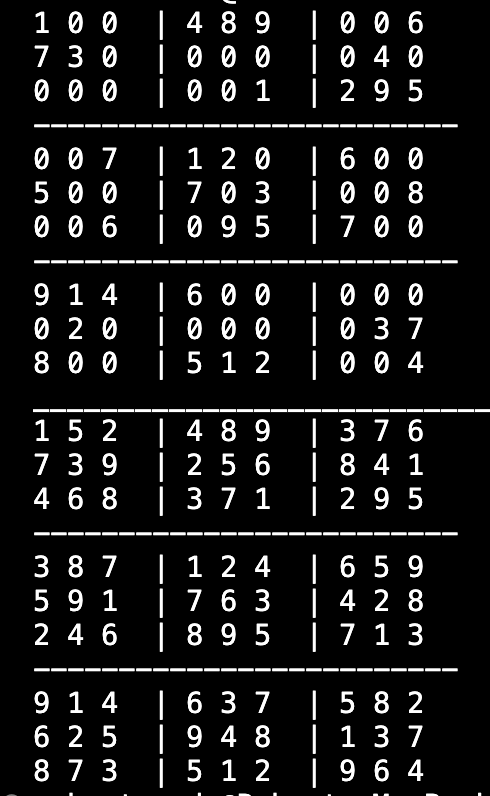

# Sudoku-Solver

 Finds the Solution for a given Sudoku Board using the backtracking algorithim.
 Starting with an incomplete board we find some empty space and attempt to place the digits 1-9 in that space. Next we can run a check on the current board. If the digit is valid, recursively attempt to fill the board. If the digit is not valid, trackback to the square you just filled and go back to the previous step. Once the board is completed we have a solution

